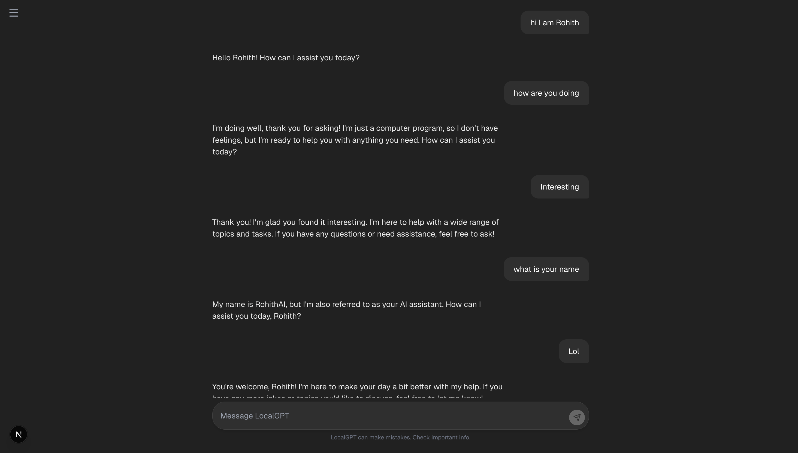

# LocalGPT

LocalGPT is a private, on-device AI chat application that runs entirely on your Mac. It leverages **Apple Silicon (M1/M2/M3)** for high-performance inference using the MLX framework, ensuring your conversations remain secure and offline.

## Features

- **100% Offline & Private**: No data leaves your device.
- **Apple Silicon Optimized**: Built on [MLX](https://github.com/ml-explore/mlx) for blazing fast performance on Mac.
- **Persistent Chat History**: Conversations are saved locally using SQLite.
- **Modern UI**: A clean, responsive interface inspired by leading chat applications.
- **No API Keys**: Run powerful LLMs without subscription fees.

## Demo

## Demo




## Tech Stack

- **Model**: `mlx-community/LFM2-1.2B-8bit` (Lightweight, fast, and capable)
- **Backend**: Python, FastAPI, LangChain, SQLite
- **Frontend**: Next.js 16, React 19, TailwindCSS, Lucide Icons

## Prerequisites

- **Mac with Apple Silicon** (M1, M2, M3, or Pro/Max/Ultra variants)
- **macOS** 13.0 or later recommended
- **Python 3.11+**
- **Node.js 18+**

## Installation

### 1. Clone the repository

```bash
git clone https://github.com/yourusername/on-device-chat.git
cd on-device-chat
```

### 2. Setup Backend

The backend runs the AI model and manages chat history.

```bash
# Create a virtual environment
python3 -m venv venv

# Activate the environment
source venv/bin/activate

# Install dependencies (MLX, FastAPI, etc.)
pip install -r requirements.txt
```

### 3. Setup Frontend

The frontend enables the chat interface.

```bash
# Navigate to frontend directory
cd frontend

# Install Node dependencies
npm install
```

## Running the App

You need to run the backend and frontend in two separate terminal windows.

### Terminal 1: Backend

```bash
# Make sure you are in the root directory and venv is active
source venv/bin/activate
uvicorn api:app --reload --port 8000
```
*Wait until you see "Model loaded" in the output.*

### Terminal 2: Frontend

```bash
# Navigate to frontend
cd frontend
npm run dev
```

Open [http://localhost:3000](http://localhost:3000) in your browser to start chatting!

## Usage

- **New Chat**: Click the "+ New Chat" button or "LocalGPT" logo to start fresh.
- **History**: Key sessions are saved automatically. Click any session in the sidebar to load it.
- **Delete**: Hover over a session in the sidebar, click the "..." menu, and select "Delete" to remove a chat permanently.

## Troubleshooting

- **Port 8000 in use**: If the backend fails to start, free up the port:
  ```bash
  lsof -t -i:8000 | xargs kill -9
  ```
- **Dependencies**: Ensure you are running on a Mac with Apple Silicon. MLX is not compatible with Intel Macs or Windows (yet).

## License

MIT